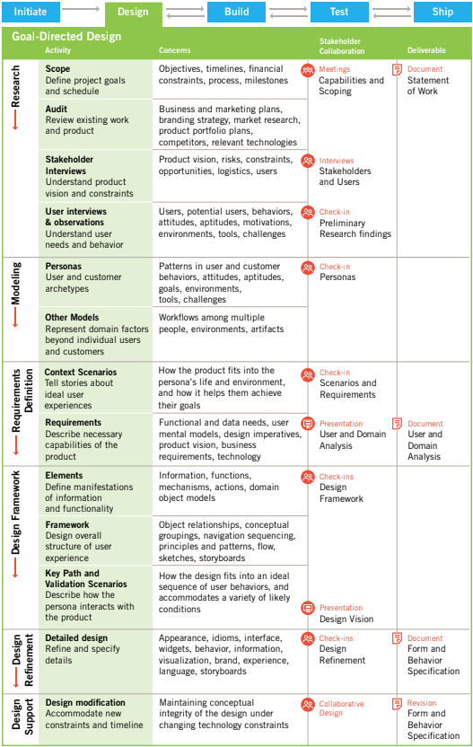

The detailed look of the goal-directed design process allows us to understand activities, concers, collaborators and deliverables 

## Research

It employs ethnographic field study techniques to provide qualitative data about potential or actual user. 

* Observation and contextual interviews
* Competitive product audits, market research reviews, technology white papers and brand strategy
* One-on-one interviews with stakeholders, developers, subject matter experts and technology experts

### Observation and contextual interviews

One of the principal outcomes is a set of emergent behavior patterns and this helps us 

* Categorize modes of use
* Map patterns into profesional roles or lifestyles
* Drive the creation of user personas

### Market research reviews

Helps us select and filter valid personas

### One-on-one interviews with stakeholders, developers, subject matter experts and technology experts

Deepens the designers understanding of the domain and elucidates business goals, brand attributes and technical constrains the design must support

## Modeling

