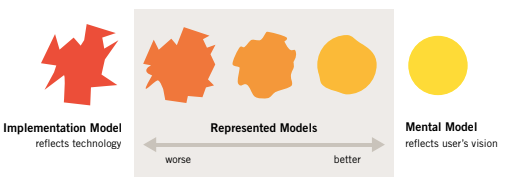
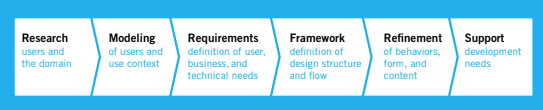

# A design process for digital products

If we design products in a way our user can achieve their goal easily they will be satisfied and happy. This translates into business success.

Absence of design as a fundamental part of product planning and developing is one of the biggest reason why we have so many difficult and unpleasant to use products

## Design

Is the conscious and intuitive effort to impose meaningful order

### Human-oriented design

Emcompasses activities such as:

* Understanding the desires, needs, motivations and context of the peiople using products
* Understanding businesss, technical, and domain opportunities, requirements and constraints
* Using this knowledge as a fundation for plans to create products whose form, content and behavior are useful, usable and desirable as well as economically visable and technically feasible

## Consequences of poor product behavior

Many companies have begun focusing on serving people's needs and spending time and money to support the design process, but there are many more companies that fail to do so. "As long as businesses continue to focus solely on technology and market data
while shortchanging design, they will continue to create the kind of products we’ve all
grown to despise"

### Digital products are rude

They blame the user for making mistakes that are not their fault, of should not be. 

* Error messages pop-ups like weed announcing the user has failed yet again, this messages demand the user acknowledging their failure by confirming it
* Confirmation messages interrogate users and patronize them with questions like "Are you sure?" which is irritating and demeaning
* Software forgets information and isn't very good at anticipating our needs

### Digital products require people to think like computers

They regularly assume that people are technology literate.

* Software is obscure, hiding meaning, behavior and actions from the user
* Applications express themselves in incomprehensible jargon like "What is your SSID?"

### Digital products have sloppy habits

They dont listen, require extra steps and have dangerous commands on sight

* Software require us to step out of the main flow to peforma actions that shouldn't require separate interfaces and extra navigation
* Application have dangeous commands presented right up front, where the user can accidentaly trigger them
* The appearance of software can be complex and confusing, making navigation and comprehension unnecesarily difficult

### Digital products require humans to do the heavy lifting

They force the user to do so much work simply to manage the proper operation of the software

* Copying and retyping values from one window to another
* Paste data between applications that otherwise dont speak to each other
* Obiquitous clicking and pushing and pulling of windows and widgets to access hidden funtionalities that people use every day 

## Why digital products fail

Instead of planning and executing with a focus on satisfying the needs of the users companies end up creating solutions that while technically advanced are difficult to use and control. They fail because they have not imbued sufficient humanity

Why is the technological industry so inept at designing the interactive parts of digital products? this are the four main reasons

**1. Misplaced priorities** on the part of both product management and development teams

**2. Ignorance about real users** of the product and what their baseline needs for success are

**3. Conflicts of interest** when development teams are charget with both designing and building the user experience

**4. Lack of design process** that permits knowledge about user needs to be gathered, analyzed and used to drive the development of the end user experience

### Misplaced priorities

Digital products are being pulled by two opposing forces marketers and developers.

* **Marketers**: Are adept at understanding and quantifying marketplace opportunities, but their input into the product design process is often limited to lists of requirements. This requirements usually have noting to do with what users actually need or desire and more to do with chasing competiting and what people say they will buy

**Users are usually incapable of articulating their needs**, and focus on low-level tasks; and `what they think they will buy doesn't tell us much about how or if they will actually use it`

Reducing an interactive product to a list of features and adding easy to use does nothing to improve the situation

* **Developers**: Often have no shortage of input into the product's final form an behavior. Good deveopers are focused on solving challenging technical problems, following good engineering practices and meeting deadlines. 

They often give incomplete, myopic, confusing and even contradictoery intructions that force decisions about the user experience with little time and knowledge about how user interact with the product

`The people responsible for creating products rarely take into account the users goals needs and motivations`. And they tend to be highly reactive to market trends and technical constraints. As a result we are left with products that lack coherent user experience

#### Results of poor product vision

* Digital products that irritate rather than please 
* Reduce productitivy
* Failure to meet user needs

Most products are stuck in the first steps of design where design either plays no real role or becomes a surface level patch **lipstick on the pig**

### Ignorance about real users

The technology industry doesn't have a good understanding of what makes the user happy. Most technology products are built without understanding the user. We may know a lot about our users but does any of this tell us:

* How to make the user happy?
* How they will use the product we are building?
* Why they need our product for?
* Why they might choose our product over our competitors?
* How can we make sure they use our product?

However we can change this, is possible to understand the user and create excellent products

### Conflicts of interest

The product development has a conflict of interest, the developers who build our products are also the ones to design them. They are often face with the choice between ease of coding vs ease of use

We need to make sure `the people designing the products are not the same people building it`, even with the best intentions is simple not possible for a person to advocate for the user, the technology and the business at the same time

### Lack of design process

One of the industry stopers to create successful, well-designed products is that there is no reliable process for doing so or a complete process. **Transforming an understanding of users into products that meet their professional, personal and emotional needs**

#### Decision making

**Worst case**: Decision about what a product will do and how it will communicate with the users are a by-products of its contruction. (Developers design product behavior as a miner designs a landscape) The product interaction alternates between accidental and nonexistent

**Adopting a design process**: Many companies try integrating customers and "domain experts" directly into the development to solve the human interface design problems. **Sharing the design responsability with the user is good effort but it has serious methodological flaw: Confusing domain knowledge with design knowledge**

* Although customers can articulate problems with an interaction they often cannot visualize its solution. 
* `Design is a specialized skill, developers would never ask users to help them code; design problems should be treated no different`
* Customers who purchase a product may be different from the people who use it from day to day
* Experts in a domain may have a hard time placing themselves in the shoes of less experienced users

#### Feedback

Designers should indeed get feedback on their proposed solutions, both from users and the product team. But `is better if designers listen to problems and propose their own solutions instead of taking proposed solutions from users at face value`

## Planning and designing product behavior

Requires a significant upfront effort, involves understanding how the humans usign the product live and work. Designing product behaviors and forms that support and facilitate the human behaviors.

**Interaction design is quite new but is has fundamentally changed how products succeed in the marketplace**. As time progressed manufacturers figured out engineering and marketing was no longer good enough to create desirable products, they needed to differentiate themselves from functionally identical products

The conscious inclusion of design heralded the ascendance of the modern triad of product development concerns by Larry Keeley

* Capability
* Viability
* Desirability

If any of these three foundations is weak a product is unlikely to stand the test of time

`Interactivity is so compelling to humans other aspects of an interactive product become marginal` this is really apparent on hardware like touch screens and mouses, but behaviors of software often receive no attention

Traditions of design dont provide much guidance in the world of interactivity. Design of behavior requires a grater knowledge of context. **How the user wants to use the product? In what ways? To what end?**

#### Interaction design

Isn't a merely matter of aesthetic choice; it is based on an understanding of users and cognitive principles. It's amenable to a repeatable process of analysis and synthesis and though it can not be automated it can be systematically approached

This of course does not mean aesthetics and rules of form can be discarted, they must work in harmony with the largest concern being achieving user goals via appropiated design behaviours

## Recognizing user goals

Users goals are often quite different from what we guess them to be. Even our users may not be verbal or even conscious about their goals

Products design and built to achieve business foals alone will eventually fail. **When the design meets the users' personal goals, the business goals are achieved far more effectively**

If we examine available applications we will find `user interfaces fail to meet user goals with alarming frequency`, some of the most common examples are

* Making users feel stupid
* Cause users to make big mistakes
* Require too much effort to operate effectively
* Don't provide and engaging or enjoyable experience

This software are equally poor at achieving its business purpose. Companies have wrong priorities; most focus too narrowly on implementation issues which distracts them from users needs

**Even when businesses become sensitive to users, they are often powerless to change their products**. The conventional development process assumes that the user interface should be addressed after coding begins, sometimes even after it ends. But you cannot easily make an application serve users’ goals as soon as a significant and inflexible code base is in place.

Or in the other hand companies focus on the users but they pay too much attention to the task users engage in and not to their goals while performing those tasks

### Goals vs task and activities

Goal is an expectation of an end condition, whereas activities and tasks are intermediate steps that help someone reach their goals

Donald Norman describes a hierarchy 

* Activities are composed of tasks
* Tasks are composed of actions
* Actions are composed of operations

Norman advocates **Activity-Centered Design** which focuses on understanding activities, he claims humans adapt to tools at hand and understanding the activities people perform in those tools can favorably influence its design

Norman's thinking comes from **Activity Theory a psychology theory that emphasizes understanding who people are by understanding how they interact with the world**. This theory has also been adapted to human-computer interaction, most notably by Bonnie Nardi

Traditional `task-based focus yields inadequate results`, approching interface design by asking what the tasks are may get the job donm but won't provide a solution that differentiates our product in the market and very often won't satify the user

ACD highlights the importance of user context, it breaks down the "What" of user behavior by it doesn't address the *why is a user performing this activity in the first place?* 

This is where goals come out, `goals motivate people to perform activities, understanding goals allows us to understand users expectations and aspirations`, which can help us understan which activities are truly relevant in our design. Task an activities are useful at the detail level, but only after user goals have been analyzed

Goals are driven by human motivations, they change very slowly, if at all, over time. Activities and tasks are much more transient, because they are based almost entirely on whatever technology is at hand.

Design solely based on understanding activities has risks of trapping the design in a model imposed by outdated technology or using models that meets corporation goals without meeting users' goals. **Goals allow us to leverage available technology and eliminate irrelevant tasks**

### Designing to meet goals in context

Ease of use is an important guideline but the design target depends on the context, always assuming making user interfaces and interactions easier can't help us create a good design if disconnected from the goals and needs of the user

A general guideline in interaction design is `good design makes users more effective` this takes into account the general goal of not looking stupid and particular business goals as business throughput and ease of use

**Software that enables users to perform their tasks without addressing their goals rarely helps them be truly effective**

Although it is the user’s job to focus on their tasks, `the designer’s job is to look beyond the task to identify who the most important users are, and then to determine what their goals might be and why.`

## Implementing models and mental models

Computer literacy is an euphemism for forcing humans to stretch their thinking to understand the inner workings of applications logic. Software products don't usually stretch to meet people's usual way of thinking

What is the role of design in translating coded functions into an understandable and pleasurable experience for users?

### Implementing models

System model or implementation model **is the representation of how an application actually works, it describes how an application is implemented in code**

Its easier to design software that reflects its implementation model but providing a button for every function, a field for every input... etc, although adequate from a engineering infrastructure stand point does little to provide coherent mechanisms for a user to achive his goals 

### Mental models

**Are cognitive shorthands people use for explaining complex mechanism without knowing all the details**. This explanation covers the interactions but doesn't necessarily reflect the actual inner mechanics

The discrepancies between the implementation and mental model of software applications is particularlyt stark. The implementation is so complex is nearly impossible for the user to see the connections between his actions and the application reactions

### Striving towards perfection: represented models

Software has a behavioral face, a representation which is not necessarily an accurate description of what going on inside the computer, and this is what we aim for, represent the actions while hiding unsavory facts of how the software is really getting the job done

The represented model is how the designer chooses to represent applications functioning to the user, `the closer the represented model comes to the user’s mental model, the easier he will find the application to use and understand` 

And as its counterpart having a represented model that follows the implementation model too closely significantly reduces the user's ability to understand, learn and use the application

Creating software's represented model that closely follows users mental models eliminates needless complexity from the user interface and makes it evident for the user how achieve his goals and meet his needs. **A design process translates the implementation of features into intuitive and desirable product behaviors**

## An overview of goal-directed design

Most traditional methods dont provide a means of translating research results into design solutions but we aim to address this using Goal-Directed methods

### Briding the gap

#### Design as product definition

Design whe properly deployed identifies user requirements and defines a detailed plan for the behavior and appearance of products. `Design provides true product definition, based on user goals, business needs and technology constraints`

#### Designers as researchers

One of the current problems with development process is that roles are over specialized, this model misses a systematic mean of translating and synthesizing the research into design solutions

We can address this teaching designers to be researchers, this also has a compelling reason, it gives designers empathy. `Direct and extend exposure to users entails designers in the users' world and gets them thinking about users long before proposing solutions`

#### Between research and blueprint: Models, requirements and frameworks

Designers have been historically out of the loop and relied on third-person accounts of user behavior and desires, this method was created as a systematic process to bridge the gap between research and design

The goal-directed design process consists of 6 phases

And it combines techniques of ethnography, stakeholder interviews, market research, detailed user models, scenario-based design, and a core set of interaction principles and patterns

